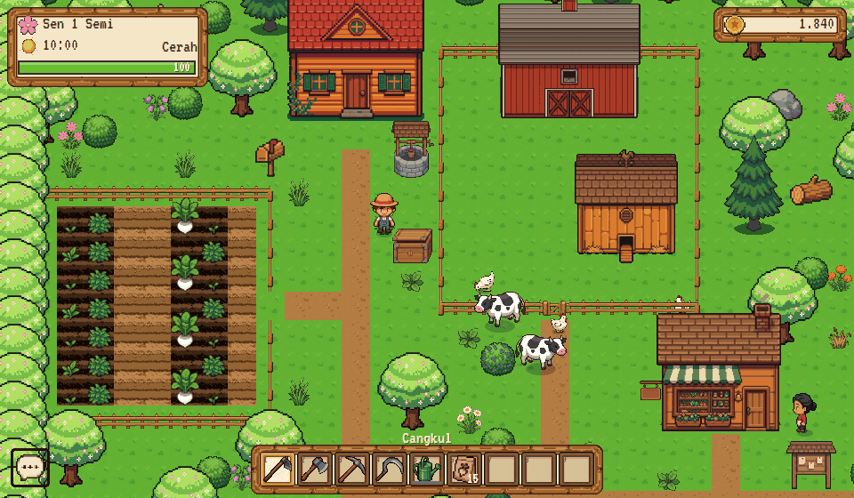
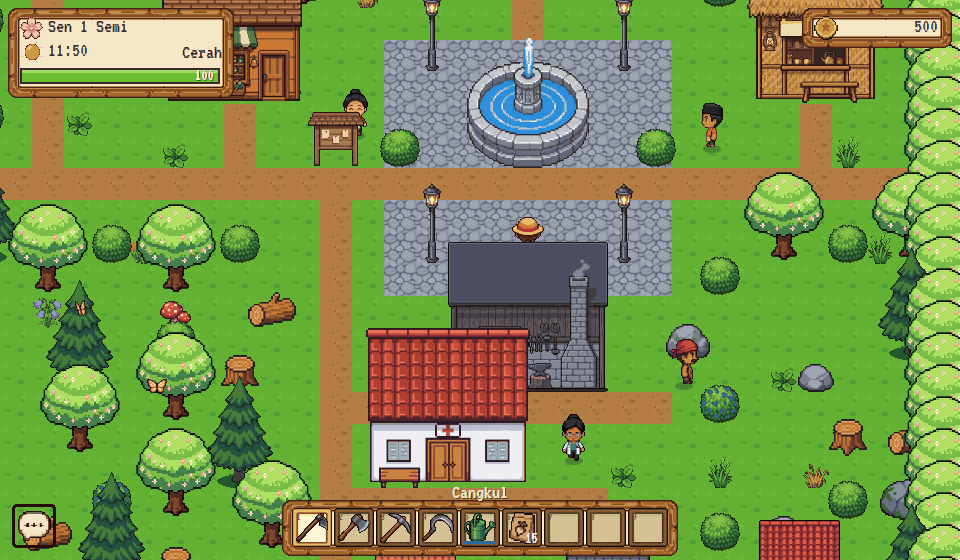
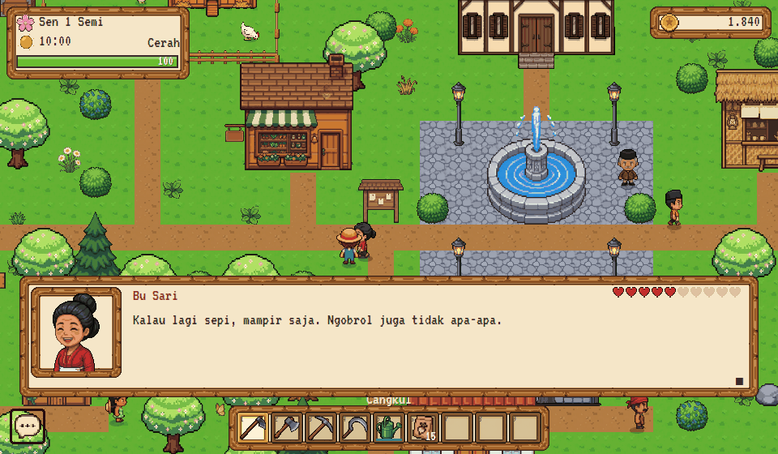
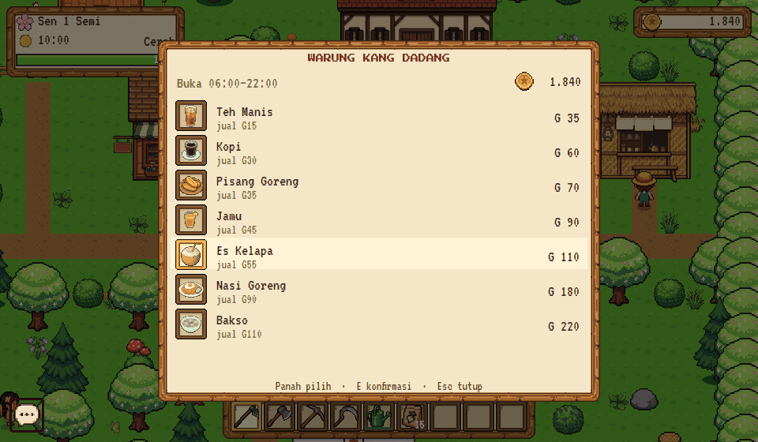
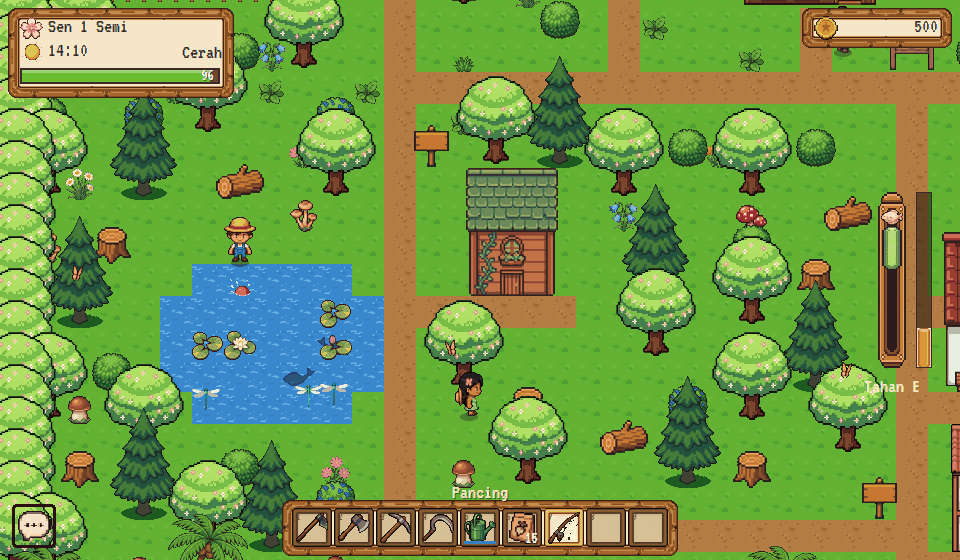

<div align="center">

# Lembah Kenanga

**Game kehidupan desa bergaya pixel art — bertani, memancing, dan berkenalan dengan warga.**
Berjalan di peramban, tanpa engine, tanpa bundler.

[](#arsitektur)
[](#arsitektur)
[](#server-obrolan--akun)
[](#server-obrolan--akun)
[](#menjalankan)



</div>

---

## Tentang

Lembah Kenanga adalah game kehidupan desa bertema Indonesia, terinspirasi Harvest
Moon dan Stardew Valley. Pemain mewarisi sebidang ladang di sebuah lembah,
menanam, memancing, berdagang, dan pelan-pelan dikenal oleh delapan warga yang
punya jadwal harian masing-masing.

Seluruhnya berjalan di peramban. Tidak ada engine, tidak ada bundler, tidak ada
langkah membangun: satu berkas HTML memuat `src/main.js` sebagai ES module, dan
itu saja. Obrolan publik dan akun pemain ditangani satu proses Python kecil yang
hanya memakai pustaka bawaan.

## Fitur

| | |
|---|---|
| 🌱 **Bertani** | Cangkul, tanam, siram, panen. Empat tanaman dengan lima tahap tumbuh, cuaca yang menyiramkan hujan sendiri |
| 🎣 **Memancing** | Mini-game tarik-ulur, delapan jenis ikan, bayangan ikan di air yang menandai titik bagus |
| 🐄 **Ternak** | Sapi, ayam, dan anjing dengan animasi jalan, makan, dan idle terpisah |
| 💛 **Persahabatan** | Delapan warga, sepuluh tingkat hati, hadiah yang dinilai per orang, dan dialog yang terbuka saat sudah akrab |
| 📋 **Titipan warga** | Satu permintaan tiap hari di Balai Desa, diundi dari nomor harinya sehingga tidak pernah berubah saat save dimuat ulang |
| 🏪 **Ekonomi** | Toko benih, pandai besi yang menaikkan level alat, warung makanan pemulih tenaga, dan klinik yang menjual istirahat |
| 🌗 **Waktu & musim** | Siklus siang-malam dengan lampu jendela dan lampu jalan, empat musim dengan terrain yang ikut berubah |
| 💬 **Obrolan publik** | Semua pemain yang sedang online bisa mengobrol, lengkap dengan penyaring kata kasar dan pembatas spam |
| 👤 **Akun** | Username tanpa kata sandi (MVP), simpanan dititipkan ke server agar bisa dilanjutkan dari komputer lain |
| 🔊 **Audio** | Musik dan 13 efek suara disintesis Web Audio — nol berkas audio yang perlu diunduh |

## Cuplikan

<table>
<tr>
<td width="50%"><br><sub><b>Pusat desa.</b> Warga berpindah tempat mengikuti jadwal tiap jam.</sub></td>
<td width="50%"><br><sub><b>Warga.</b> Hati bertambah dari menyapa dan memberi hadiah.</sub></td>
</tr>
<tr>
<td width="50%"><br><sub><b>Warung.</b> Semua tempat dilayani dari depan pintunya, tanpa layar memuat.</sub></td>
<td width="50%"><br><sub><b>Memancing.</b> Bayangan ikan di air menandai titik yang bagus.</sub></td>
</tr>
</table>

## Menjalankan

Butuh **Python 3.9+**. Tidak ada `npm install`, tidak ada `pip install`.

```bash
git clone https://github.com/bangtutorial/lembah-kenanga.git
cd lembah-kenanga
python tools/serve.py
```

Buka **http://localhost:47311**.

Server bawaan itu sekaligus menyajikan berkas statis dan menangani obrolan. Kalau
hanya ingin mencoba gamenya, peramban saja sudah cukup — tanpa server Python,
game tetap jalan, hanya obrolan dan akunnya yang mati.

### Kontrol

| Tombol | Fungsi |
|--------|--------|
| `WASD` / panah | Berjalan |
| `Shift` (tahan) | Berlari |
| `E` / `Spasi` | Pakai barang yang dipegang, makan, bicara, panen, tidur, buka toko |
| `G` | Beri hadiah ke warga |
| `1`–`9`, `X` / `Z` | Pilih alat |
| `I` / `Tab` | Inventori (`Backspace` membuang barang) |
| `Esc` | Menu, pengaturan, dan daftar kontrol lengkap |

## Arsitektur

Tidak ada engine, tidak ada bundler, tidak ada langkah membangun. Muat ulang
peramban, perubahan langsung terlihat.

- **Render** — Canvas 2D, satu lintasan yang diurutkan menurut `y` sehingga objek
  di depan menutupi yang di belakang. Pembaruan langkah tetap 60 Hz, penggambaran
  mengikuti `requestAnimationFrame`.
- **Peta** — dibangun ulang dari benih (mulberry32) tiap kali dimuat, jadi
  deterministik. **Save hanya menyimpan perubahannya** — pohon yang ditebang,
  tanah yang dicangkul — bukan seluruh peta.
- **Save** — `localStorage` dengan `SAVE_VERSION` dan migrasi, plus salinan
  `.bak`. Simpanan yang sama juga dititipkan ke server kalau pemain punya akun.
- **Tata letak** — `src/world/layout.js` memuat anggaran yang bisa diukur
  (kepadatan, ruang kosong terbesar, jarak antar distrik) dan sebuah audit yang
  memeriksanya, supaya peta yang dibangun prosedural tidak pelan-pelan berantakan.
- **Audio** — disintesis Web Audio, tidak ada berkas yang diunduh.

### Server obrolan & akun

`tools/serve.py` — HTTP biasa, tanpa kerangka kerja, hanya pustaka bawaan Python.

- **Long-poll, bukan WebSocket.** Satu GET ditahan sampai 20 detik dan dijawab
  begitu ada yang bicara. Pesan tetap tiba seketika, tanpa timer yang menggedor
  server, dan tetap lewat di belakang proxy mana pun.
- **SQLite dengan jurnal WAL**, satu sambungan per thread.
- **Penjaga di `tools/guard.py`** — batas laju per-IP, batas ukuran badan
  permintaan yang **ditolak sebelum dibaca**, dan pembaca JSON yang menolak apa
  pun selain objek.
- **Penyaring di `tools/moderation.py`** — menyensor, bukan menolak; angka dan
  simbol yang dipakai menyamarkan huruf ikut dipetakan.

## Bagaimana asetnya dibuat

Seluruh gambar dihasilkan dengan model generatif, lalu diolah dengan skrip
Python di `tools/`:

| Skrip | Gunanya |
|-------|---------|
| `chroma_key.py` | Latar hijau → transparan, dengan despill. Opsi `--hard` membuang bayangan setengah tembus; `--unspill` membersihkan warna latar yang tembus lewat benda bening |
| `slice_grid.py` | Memotong sheet jadi frame, menyamakan baseline, menormalkan skala |
| `tint_tile.py` | Menurunkan varian terrain dari tile yang sudah ada, dengan target terang sebagai angka |
| `build_animal_strip.py` | Mendeteksi frame dari celah transparan, karena modelnya tidak selalu menaruhnya di grid rapi |
| `check_scale.py` | Membandingkan tiap sprite dengan tabel ukuran kanonis di `assets/scale.json` |
| `publish.py` | Menyusun `dist/` berisi hanya yang dibuka peramban |

Prompt card dan catatan tiap batch aset ada di
**[docs/ASSETS.md](docs/ASSETS.md)**.

## Struktur

```
index.html            Homepage: cara main, daftar karakter, tentang
game.html             Gamenya
src/
  main.js             Pengikat: loop, interaksi, penggambaran
  core/               Waktu, input, save, akun, event, PRNG
  systems/            Bertani, memancing, persahabatan, titipan, obrolan, audio, satwa
  entities/           Karakter, warga, ternak
  world/              Pembangun peta, anggaran tata letak
  ui/                 HUD, dialog, inventori, toko, obrolan, menu
  render/             Pemuat aset dan renderer
  data/               items, crops, npcs, shops, fish (JSON)
assets/
  manifest.json       Daftar sprite: ukuran frame, kolom/baris, pivot
  scale.json          Tabel ukuran kanonis — sumber kebenaran untuk check_scale.py
  sprites/            PNG. Yang dimuat game hanya berkas yang disebut manifest;
                      potongan per-frame hasil slicer ikut disimpan agar
                      asetnya mudah dipakai ulang di tempat lain
tools/                Pipeline aset (Python) + server obrolan
```

## Dokumentasi

| Berkas | Isinya |
|--------|--------|
| **[docs/DESIGN.md](docs/DESIGN.md)** | Keputusan teknis dan alasannya |
| **[docs/ASSETS.md](docs/ASSETS.md)** | Prompt card dan catatan tiap batch aset |
| **[docs/AUDIO.md](docs/AUDIO.md)** | Panduan menggenerate musik latar sendiri |

## Memasang di server

Yang dibutuhkan hosting mana pun — panel apa pun, atau tanpa panel sama sekali:

1. **Berkas statis.** Jalankan `python tools/publish.py`; ia menyusun `dist/`
   (±3 MB) berisi hanya yang dibuka peramban. Isi folder itu yang diunggah.
2. **Satu proses Python.** `python tools/serve.py 47311 --host 127.0.0.1` untuk
   obrolan dan akun. Cukup satu proses: obrolan menunggu pesan baru lewat
   `threading.Condition` di dalam satu proses, dan SQLite-nya satu berkas.
3. **Teruskan `/api/` ke proses itu** lewat reverse proxy. Matikan buffering dan
   beri batas baca lebih dari 20 detik — satu GET memang ditahan selama itu.
   Teruskan juga IP asli pemanggil apa adanya, karena batas laju di
   `tools/guard.py` membacanya dari `X-Forwarded-For`.
4. **Letakkan basis datanya di luar akar web** lewat `LK_CHAT_DB`.

Tanpa langkah 2 dan 3 game tetap bisa dimainkan; hanya obrolan dan akunnya yang
mati. Game juga bisa dipasang di subfolder tanpa mengubah kode — alamat API
dihitung dari alamat modulnya sendiri di `src/core/api.js`.

> **Jangan menyajikan folder projek apa adanya.** Di dalamnya ada `var/chat.db`
> yang memuat username dan kunci sesi pemain. Unggah keluaran `publish.py`.

## Lisensi

[MIT](LICENSE)
